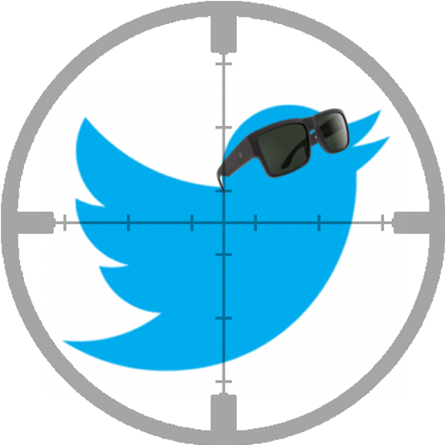

<h1>
Studying Twitter User Accounts:
 
Spotting Suspicious Social Bot Behavior
</h1>

<h3>
Abstract
</h3>

With a focus on the original tweets published during the first round of the 2017 Chilean presidential elections, this work aims to study the behavior of Twitter users by specific patterns retrieved from their tweets, such as the user’s metadata, number of friends, followers, content, network, and time series. Each pattern is studied both individually and across different subsets of users, such as the number of tweets per account per day, newly created accounts, and so-called simple bots. Networking and timing related features proved to be critical in bot detection. Twitter users considered to “behave” like bots are compared with web applications (apps) used for bot detection. This work explores the visual analysis of groups of users with similar characteristics (clusters), suggesting that a bot behavior can be visually detected using dimensional reduction techniques such as Uniform Manifold Approximation and Projection (UMAP). The methodology used in this work can be applied to identify social bot behaviors in any set of tweets captured in a specific time frame.

  
