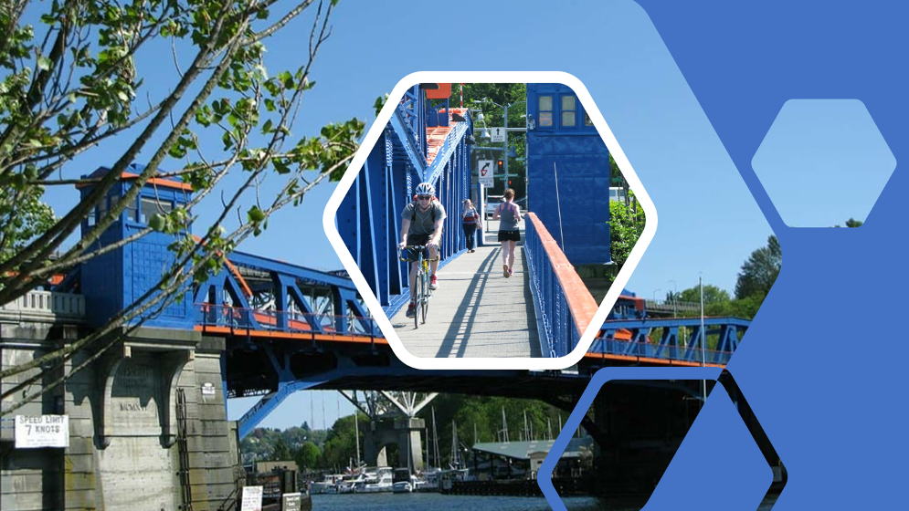

<h1>Prediccion Tráfico de Bicicletas usando DL/LSTM</h1>

 
Este trabajo utiliza el modelo LSTM de Deep Learning para predecir el número de bicicletas que pasan diariamente por la puente de Fremont Bridge en Seattle, WA EE.UU. El modelo es ajustado, variandose varios hiperparámetros como:
• Ventana de tiempo
• Número de neuronas • Número de épocas
• Porcentaje de dropouts
• Optimizer
Además, el mejor modelo lSTM se enfrentará a otro modelo de previsión de series temporales, Prophet, desarrollado por Facebook.
